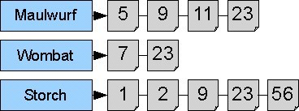

# Modulprüfung Programmierung

**Sommersemester 2025**

**Studiengänge:** B.A. Informationsverarbeitung, B.A. Medieninformatik

---

## Beschreibung der Anwendung

Bei dem Programm **LitScan** handelt es sich um einen literaturwissenschaftlichen Text-Explorer. Ziel ist es, literarische Texte in XML- oder TXT-Format (z. B. Romane, Dramen, Gedichte) analysieren und durchsuchen zu können. Die Anwendung richtet sich an geisteswissenschaftliche Nutzer\:innen, die z. B. Motive, Schlüsselwörter oder stilistische Eigenheiten untersuchen möchten (um einen wirklichen Nutzen zu haben, müsste das Projekt allerdings noch weiter ausgebaut werden).

Die Ausgabe der Suche erfolgt als *keyword-in-context*-Liste (KWIC), die das Suchwort mit umgebendem Kontext anzeigt.

Das Programm läuft im Terminal (Console) und akzeptiert dort einfache Befehle mit Parametern.

---

## Befehle

### `import`

Importiert ein literarisches Korpus aus einem Verzeichnis mit XML-Dateien. Syntax:

```bash
import <Verzeichnisname> [Korpusname]
```

Ohne expliziten Namen wird der Verzeichnisname als Korpusname verwendet. Es werden alle `.xml`-Dateien im Verzeichnis eingelesen.

### `load`

Lädt ein zuvor importiertes Korpus zur weiteren Analyse. Danach wird der Korpusname vor dem Prompt angezeigt.

```bash
load [Korpusname]
```

### `search`

Führt eine tokenbasierte Suche nach einem Wort durch. Treffer werden als KWIC-Liste ausgegeben. Optional kann die Suche groß-/kleinschreibungsunabhängig durchgeführt werden (siehe 4.1).

```bash
search [Suchterm]
```

### `stats`

Gibt globale Statistiken über das aktuell geladene Korpus aus:

- Anzahl der importierten Dokumente
- Anzahl der Tokens
- Anzahl verschiedener Tokens (Types)
- Type-Token-Ratio (TTR)
- Durchschnittliche Tokenanzahl pro Dokument

### `docstats`

Gibt für jedes Dokument im Korpus folgende Werte aus:

- Dokumentname
- Anzahl der Tokens
- Anzahl unterschiedlicher Tokens (Types)
- Type-Token-Ratio (TTR)

---

## Aufgabe

Die Aufgaben bestehen darin, Implementierungen für die Interfaces `IFileImporter`, `ICorpusDocument` , `ICorpus` und `ITokenizer` bereitzustellen. Arbeiten Sie in der vorgeschlagenen Reihenfolge. Vorlagen dafür finden Sie im package *idh.java.litscan.impl*


---

### 1. Import literarischer Texte

Die Methoden `importXML/TXTFile(File)` im Interface `IFileImporter` importiert ein einzelnes literarisches Werk:

- Prüfen Sie, ob die Datei existiert und lesbar ist.
- Falls es sich um eine XML-Datei handelt: Überprüfen Sie, ob sie wohlgeformtes XML enthält. 
- Extrahieren Sie den gesamten Textinhalt (d.h. auch Whitespaces) und speichern Sie ihn in einem `CorpusDocument`-Objekt.


---

### 2. Tokenisierung

Die Methode `tokenize(String)` im Interface `ITokenizer` zerteilt den Text in Tokens. Dabei ist jedes Token eine Zeichenkette mit definierter Start- und Endposition (wie bei `Token(begin, end)`).

Die Tokenisierungsregeln orientieren sich an typischen Trennzeichen (Leerzeichen, Interpunktion). Wichtig: Alle Zeichen (auch Zeilenumbrüche und Sonderzeichen) zählen mit für die Positionsangaben.

---

### 3. Dokumente im Korpus

Jede literarische Datei (z. B. ein Roman, ein Gedicht, ein Drama) wird durch ein Objekt vom Typ `CorpusDocument` repräsentiert. Diese Klasse implementiert das Interface `ICorpusDocument` und bildet die zentrale Datenstruktur für einzelne Werke im Korpus.

Ein `CorpusDocument` speichert:

- **Titel und ID** des Dokuments (werden z. B. aus dem Dateinamen oder aus dem XML-Header extrahiert)
- **Textinhalt** (als reiner Fließtext)
- **Tokens** (eine Liste aller im Text erkannten Tokens mit Start- und Endposition)
- **Types** (die im Text vorkommenden verschiedenen Wörter)
- **TTR-Wert** (*Type-Token-Ratio*, also Verhältnis von Types zu Tokens)

Diese Informationen dienen als Grundlage für Suchfunktionen und statistische Analysen. Die Dokumente können zudem anhand ihrer Tokenanzahl sortiert werden.

> **Hinweis:** Die Methoden `setTextContent()` und `setId()` dürfen jeweils nur einmal aufgerufen werden. Weitere Aufrufe sollen zu einer `InvalidOperationException` führen.

---

### 4. Suche und Analyse im Korpus

Die Klasse, die das Interface `ICorpus` implementiert, speichert die importierten Werke in einem invertierten Index:

- Methode `add(CorpusDocument)` fügt ein Werk dem Index hinzu.
- Methode `search(String term, boolean ci)` sucht nach dem Token `term`. Wenn `ci == true`, wird case-insensitive gesucht (siehe optionale Aufgabe 5.1).
- Zusätzlich müssen Methoden zur Berechnung der globalen und dokumentbasierten Statistiken implementiert werden, wie unter den Befehlen `stats` und `docstats` beschrieben.

---

## 5. Optionale (freiwillige) Aufgaben

### 5.1 Case-Insensitive Search 

Implementieren Sie eine groß-/kleinschreibungsunabhängige Suche. Beispiel:

```bash
search Liebe ci
```

...findet „Liebe“, „liebe“, „LIEBE“ usw.

### 5.2 Termgewichtung mit tf-idf (freiwillig)

Ergänzen Sie eine Methode zur Berechnung von [tf-idf-Werten](https://de.wikipedia.org/wiki/Tf-idf-Ma%C3%9F) für einzelne Tokens in den Texten. Diese kann dann als Sortierung in der KWIC-Ausgabe genutzt werden (absteigende Reihenfolge). 

---

## Bewertung und Abgabe

Ihr Programm muss alle vorgegebenen Unit-Tests bestehen. Die optionalen Aufgaben werden bei Bestehen mit Zusatzpunkten honoriert.

**Weitere Bewertungskriterien:**

- Korrektheit und Robustheit
- Dokumentation und Kommentare
- Codequalität
- Erfüllung optionaler Aufgaben
- ggfs. Codeerläuterung im Relexionsgespräch

**Abgabe:** Als `.zip`-Datei über ILIAS hochladen.

---

## Hinweise

### Tokenizer

Da wir in unserem Falle an Character-Positionen interessiert sind, helfen uns die von der Java-Bibliothek bereitgestellten Klassen `StreamTokenizer` und `StringTokenizer` nicht weiter. Wie immer gibt es verschiedene Möglichkeiten, das Problem zu lösen, aber sei hier kurz skizziert:

Die [String](https://docs.oracle.com/javase/8/docs/api/index.html?java/lang/String.html)-Klasse stellt die Methode `indexOf()` bereit, die *im Prinzip* für uns nützlich sein kann. Sie gibt uns in einem String die (erste oder nächste) Position eines Zeichens an. Wenn wir nun eine Zählervariable verwenden, um über die einzelnen Positionen des Strings zu iterieren, können wir sozusagen nach vorne schauen, und herausfinden, wo jeweils das nächste Trennzeichen ist. Diese Zahl + 1 bildet dann den Anfang des nächsten Tokens.

### Suche

Ein invertierter Index enthält das gesamte Vokabular der indexierten Dokumente (also alle in ihnen vorkommenden verschiedenen Wörter je einmal, auch Types genannt). Jedes Wort ist dabei an eine Liste (o.ä.) geknüpft, in der alle Dokumente aufgelistet sind, in denen das Wort vorkommt (also deren Namen, Pfad o.ä. - nicht die gesamten Dokumente!).

Invertiert wird dieser Index deshalb genannt, weil nicht die Dokumente die in ihnen enthaltenen Wörter listen, sondern die Wörter die Dokumente, in denen sie vorkommen. Eine solche Dokumentenliste bezeichnet man auch als Postings List.

Folgende Abbildung zeigt vereinfacht einen invertierten Index. Links finden sich die Wörter (Types), rechts in einer Liste die Dokumente (hier mit Nummern unterschieden), in denen die entsprechenden Wörter vorkommen:



### Beispiele für literarische Werke (Testdaten)

- Deutsche Dramen (german-plays), XML
- Deutsche Lyrik (german-lyric), XML
- Deutsche Prosa (german-prose), TXT


---

## Fragen

Bitte beachten Sie die Abgabemodalitäten in ILIAS! Bei Rückfragen wenden Sie sich gerne an [mich](mailto:\[hermesj@uni-koeln.de]).
